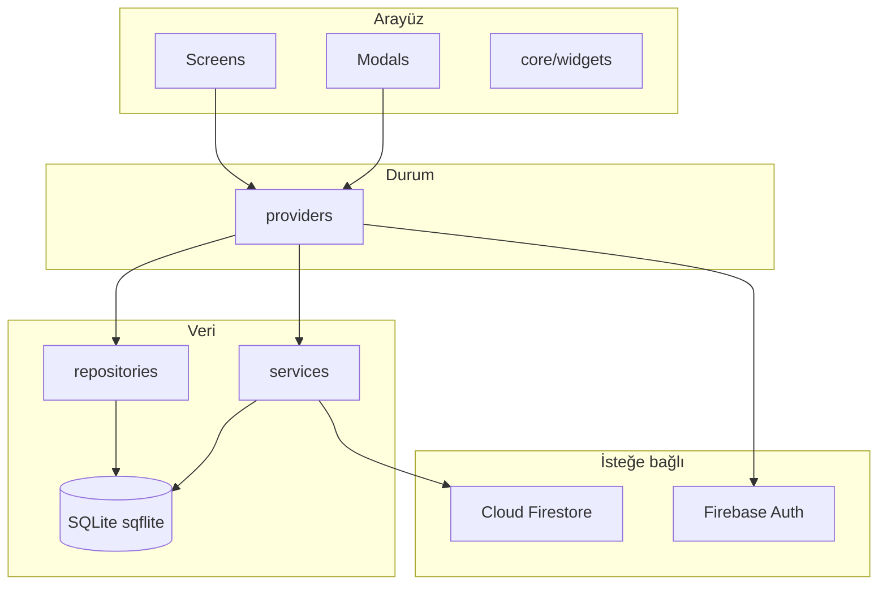

# UpSchool Projesi — myNewHabit

**myNewHabit**, günlük planlama (takvim etkinlikleri), tekrarlayan alışkanlıklar ve yapılacakları tek uygulamada birleştiren Flutter tabanlı bir günlük yönetim aracıdır. Veri modeli **yerel önceliklidir** (SQLite); isteğe bağlı olarak **Firebase Authentication** ve **Cloud Firestore** ile bulut oturumu ve senkron kullanılabilir.

Bu depo ürün gereksinimleri, agile plan ve `myNewHabit` altında yer alan uygulama kaynak kodunu içerir.

---

## İçindekiler

- [Özellikler](#özellikler)
- [Mimari özeti](#mimari-özeti)
- [Depo yapısı](#depo-yapısı)
- [Teknoloji yığını](#teknoloji-yığını)
- [Gereksinimler ve kurulum](#gereksinimler-ve-kurulum)
- [Çalıştırma ve geliştirme](#çalıştırma-ve-geliştirme)
- [Firebase (V2 / bulut modu)](#firebase-v2--bulut-modu)
- [Veri katmanı](#veri-katmanı)
- [Test ve kalite](#test-ve-kalite)
- [Yol haritası](#yol-haritası)
- [Dokümantasyon](#dokümantasyon)
- [Katkı ve lisans](#katkı-ve-lisans)

---

## Özellikler

### Ana sayfa (seçili güne göre)

| Bölüm | Açıklama |
|--------|----------|
| **Takvim çubuğu** | Yatay kaydırılabilir bar; bugün merkezli yaklaşık ±10 gün görünümü; seçili gün tüm listeleri filtreler. |
| **Takvim etkinlikleri** | Saatli planlar (`event`), kronolojik liste, tamamlama kutusu. |
| **Alışkanlık takibi** | Tekrar günleri veya aralığa göre planlanan alışkanlıklar; **%0–100 ilerleme**; tamamlanma eşiği `target_progress` ile uyumlu. |
| **Yapılacaklar** | Öncelik şeridi ve checkbox; **sıralama** (önem / bitiş tarihi) ve **zaman aralığı** (bugün, hafta, ay, tümü) filtreleri. |

### Kayıt tipleri

- **Takvime ekle (`event`)** — Başlık, tarih/saat, isteğe bağlı bitiş saati ve açıklama.  
- **Alışkanlık (`habit`)** — Tekrar günleri veya `interval_days`, önem, hedef yüzde, ikon.  
- **Yapılacak (`todo`)** — Önem, isteğe bağlı bitiş tarihi, açıklama; tek seferlik tamamlama.

### Etkileşim ve kurallar

- **Uzun basma:** Kartlarda düzenleme (bottom sheet) ve silme (tam ekran onay). Silmede ilgili tamamlanma ve seri verileri de temizlenir.  
- **Seri (streak):** Hedef yüzdesine ulaşılan planlı günler seriye eklenir; haftada bir **Es geç**, **kurtarma günü** ve **sert kapanış** kuralları PRD ile uyumludur (ayrıntı: `prd.md` §2.3).  
- **Kapsam dışı:** “Kötü alışkanlık / bırakma takibi” özelliği ürün kapsamından çıkarılmıştır.

### Profil ve bulut (kısmen / isteğe bağlı)

- Profil: özet istatistikler, bulut senkron durumu ve oturum (Firebase kullanıldığında).  
- Onboarding ve bildirimler: PRD ve `agilePlan.md` içindeki Sprint 7 maddeleriyle hizalanır.

---

## Mimari özeti

Uygulama **katmanlı** bir yapı kullanır: `core` (tema, yönlendirme, ortak widget’lar), `data` (SQLite, modeller, repository’ler, servisler), `providers` (Provider / `ChangeNotifier`), `screens` ve `modals`.



**Navigasyon:** `go_router` (`lib/core/router/app_router.dart`).  
**Durum:** Bloc / Riverpod kullanılmaz; yalnızca **Provider** (`.rules/01-tech-stack.md`).

---

## Depo yapısı

| Yol | İçerik |
|-----|--------|
| **`myNewHabit/`** | Flutter uygulaması (`pubspec.yaml`, `lib/`, `android/`, `ios/`, …) |
| **`prd.md`** | Ürün gereksinim dokümanı: V1 MVP (yerel) ve V2 (Firebase, takvim senkronu, sosyal özellikler) |
| **`agilePlan.md`** | Sprint planı, tamamlanan işler (Sprint 4–6) ve kalan MVP maddeleri (Sprint 7) |
| **`.rules/`** | Teknik yığın, zorunlu `lib/` klasör yapısı, isimlendirme, tasarım token’ları |
| **`.promt/`** | Geliştirici prompt ve log (operasyonel; uygulama çalışması için gerekli değil) |

`myNewHabit/lib` altında öne çıkan dizinler:

| Dizin | Rol |
|--------|-----|
| `core/theme`, `core/router`, `core/widgets` | Tema, spacing, ortak bileşenler, yönlendirme |
| `data/database` | `DatabaseHelper`, migrasyonlar |
| `data/models` | `Record`, tamamlanma, seri, senkron meta vb. |
| `data/repositories` | Kayıt, tamamlanma, seri erişimi |
| `data/services` | Örn. `streak_service`, `cloud_sync_service`, bildirimler |
| `data/auth` | Soyutlama + Firebase / mock uygulamaları |
| `providers` | `RecordProvider`, `CompletionProvider`, `StreakProvider`, oturum ve senkron durumu |
| `screens`, `modals` | Ana shell, ana sayfa, profil, odak bölümü, formlar ve sheet’ler |

---

## Teknoloji yığını

| Katman | Teknoloji |
|--------|-----------|
| Dil | Dart (null safety), SDK **^3.11.5** (`myNewHabit/pubspec.yaml`) |
| UI | Flutter, Material, `google_fonts` (Plus Jakarta Sans), `intl` (`tr_TR` tarih formatı) |
| Durum | **provider** |
| Yönlendirme | **go_router** |
| Yerel veri | **sqflite**, `path` |
| Kalıcı bayraklar | **shared_preferences** (ör. onboarding) |
| Kimlik / bulut | **firebase_core**, **firebase_auth**, **cloud_firestore**, **google_sign_in**, **sign_in_with_apple** |
| Kimlik | **uuid** |
| Bildirimler | **flutter_local_notifications** |
| Test (masaüstü/CI) | **sqflite_common_ffi**, **flutter_test**, **flutter_lints** |

Tasarım renkleri ve 4px grid gibi token’lar `lib/core/theme/` ve `.rules/01-tech-stack.md` içinde tanımlıdır; sabitleri kod içinde rastgele tekrarlamayın.

---

## Gereksinimler ve kurulum

1. [Flutter SDK](https://docs.flutter.dev/get-started/install) kurulu olsun; `flutter doctor` çıktısında iOS/Android araçları ihtiyaca göre tamamlanmış olsun.  
2. Depoyu klonlayın ve uygulama dizinine geçin:

```bash
git clone <bu-deponun-urlsi> UpSchool_Projem
cd UpSchool_Projem/myNewHabit
flutter pub get
```

3. iOS için CocoaPods:

```bash
cd ios && pod install && cd ..
```

---

## Çalıştırma ve geliştirme

```bash
cd myNewHabit
flutter devices
flutter run -d <cihaz_id>
```

Statik analiz:

```bash
cd myNewHabit
dart analyze
```

Sürüm ve paket bilgisi: `myNewHabit/pubspec.yaml` içindeki `version` ve `environment.sdk`.

---

## Firebase (V2 / bulut modu)

Bulut oturumu ve Firestore senkronu için aşağıdakilerin tutarlı olması gerekir:

- Firebase Console’da proje; **Authentication** (Google, Apple, e-posta/şifre) ve **Firestore** kuralları (`firebase/firestore.rules` ile uyum).  
- `flutterfire configure` ile üretilen **`lib/firebase_options.dart`**.  
- Android: `android/app/google-services.json`; imzalama için gerekli **SHA-1** kayıtları.  
- iOS: `ios/Runner/GoogleService-Info.plist`; Apple ile giriş için Xcode capability.

Canlı ortamda yer tutucu yapılandırma kullanmayın. Kontrol listesinin tamamı: `.rules/01-tech-stack.md` (Firebase Console bölümü).

---

## Veri katmanı

Ana SQLite tabloları (özet):

- **`records`** — `type`: `event` | `habit` | `todo`; ortak ve tipe özel alanlar (`scheduled_*`, `repeat_days`, `due_date`, `target_progress`, …).  
- **`completions`** — Günlük satır başına durum (`done` / `skipped` / `partial`) ve alışkanlık için `progress` (0–100).  
- **`streaks`** — Seri sayaçları, haftalık es geç, kurtarma ve seri kapanışı ile ilgili alanlar (PRD ve migrasyonlarla uyumlu).

Tam şema ve silme davranışı (`ON DELETE CASCADE`): **`prd.md`** §8. Firestore koleksiyon taslağı: **`prd.md`** V2 bölümü.

---

## Test ve kalite

```bash
cd myNewHabit
flutter test
```

Repository ve provider testleri `test/` altında; SQLite testleri için `sqflite_common_ffi` kullanılır. Yeni özellik eklerken ilgili repository veya provider’a yönelik test eklenmesi önerilir.

---

## Yol haritası

| Aşama | Durum |
|--------|--------|
| **V1 — Yerel MVP** | Sprint 4–6 (veri modeli, ana sayfa UI, streak) tamamlanmış; Sprint 7 (onboarding, profil tamamlama, bildirimler, QA) `agilePlan.md` üzerinden takip edilir. |
| **V2 — Production** | Firebase (mevcut kod yolları), takvim API senkronu, sosyal özellikler: `prd.md` §V2. |

Ürün vizyonu ve “Definition of Done” tabloları: **`prd.md`** ve **`agilePlan.md`**.

---

## Dokümantasyon

| Dosya | Konu |
|--------|------|
| [prd.md](prd.md) | Ekran davranışları, kayıt tipleri, bildirimler, V1 şeması, V2 mimarisi |
| [agilePlan.md](agilePlan.md) | Sprint içerikleri, kullanıcı hikayeleri, kabul kriterleri |
| [.rules/01-tech-stack.md](.rules/01-tech-stack.md) | Yığın, `lib/` yapısı, Firebase kontrol listesi, isimlendirme |
| [myNewHabit/README.md](myNewHabit/README.md) | Uygulama dizininden hızlı komut özeti |

---

## Katkı ve lisans

- Kod stili ve klasör kuralları: **`.rules/`** ile hizalayın.  
- Büyük davranış değişikliklerinden önce **PRD** ve **agile plan** ile uyumu doğrulayın.  
- Lisans ve resmi katkı rehberi depoya eklendiğinde bu bölüm güncellenebilir.

---

**Özet:** `myNewHabit` klasöründe `flutter pub get` ve `flutter run` ile çalıştırın; ürün ve sprint ayrıntıları için kök dizindeki `prd.md` ve `agilePlan.md` dosyalarını kullanın.
