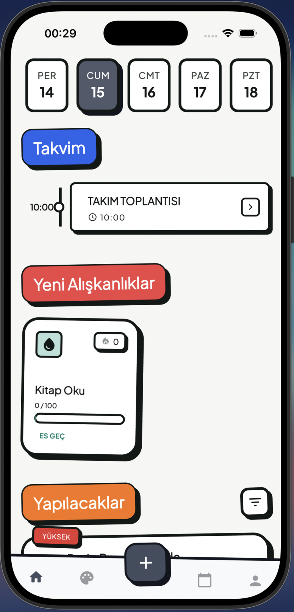
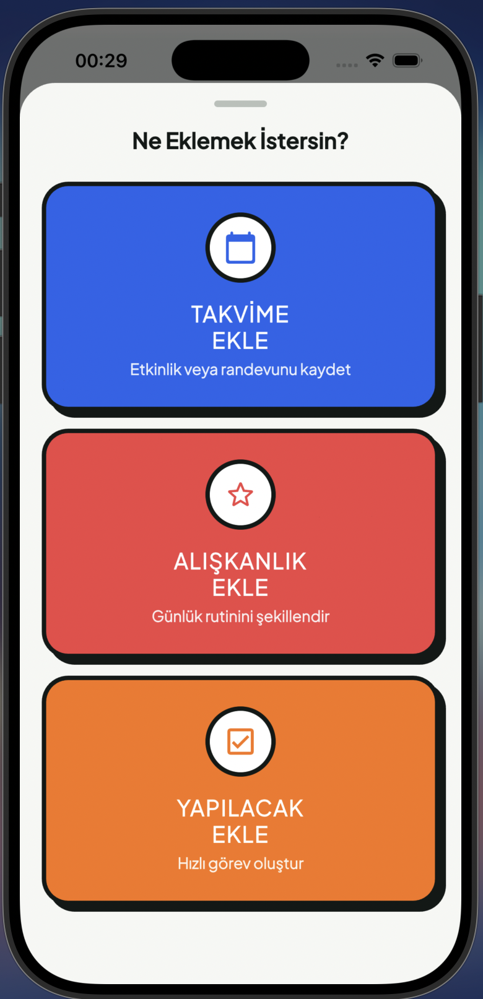
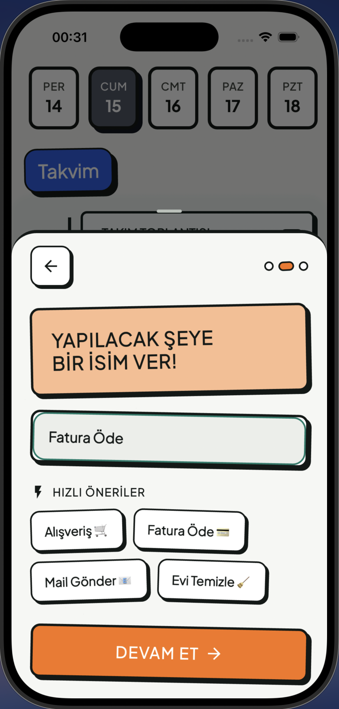
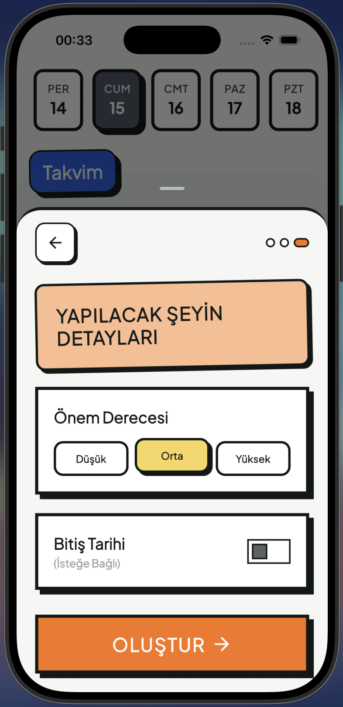
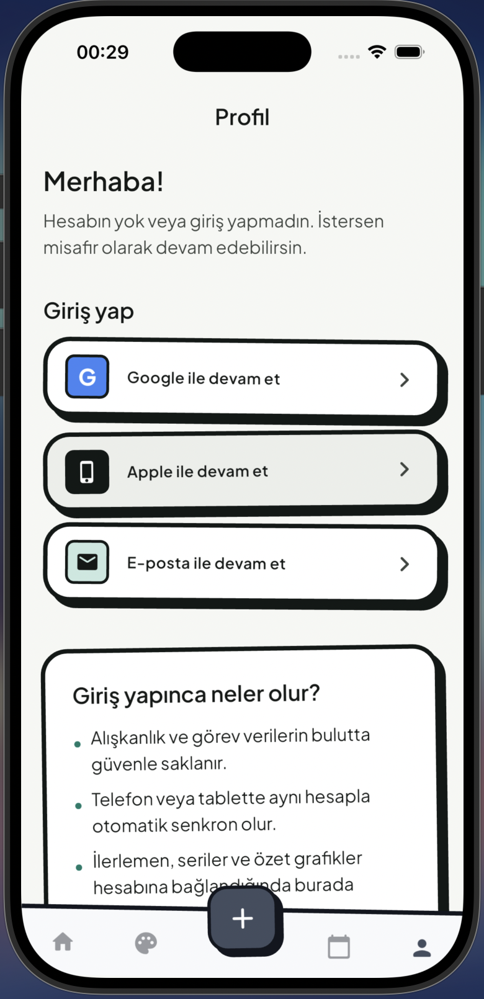

# UpSchool — Track: Calendar, tasks, habits

**track_calendar_tasks_habits**, takvim etkinlikleri, tekrarlayan alışkanlıklar ve yapılacakları tek Flutter uygulamasında toplar.

---

## Sürüm özeti

| Sürüm | Amaç |
|--------|------|
| **v0.1** | Tam yerel: SQLite (veya eşdeğeri), internetsiz çalışan tüm akışlar; onboarding ve splash dahil |
| **v0.2** | Firebase Auth, çok cihazlı senkron, harici takvim kaynakları, ana ekran widget’ları, rozetler, sosyal paylaşım |

---

## Gereksinimler

- [Flutter SDK](https://docs.flutter.dev/get-started/install) (projede `sdk: ^3.11.5`)
- Xcode (iOS) veya Android Studio / SDK (Android)

---

## Kurulum ve çalıştırma

```bash
cd track_calendar_tasks_habits
flutter pub get
flutter run
```

---

## Depo yapısı (özet)

```text
track_calendar_tasks_habits/
  lib/
    core/          # Tema, yönlendirme, ortak widget’lar
    screens/       # Ana ekranlar (home, profile, shell, …)
    modals/        # Alt sayfalar ve formlar
    providers/     # Durum yönetimi (Provider)
    data/          # Modeller, repository’ler (v0.1’de genişletilecek)
  android/  ios/  …
```

---

## Mimari notu

- Arayüz: Flutter + Material 3, `go_router`, `provider`.
- Tema: `lib/core/theme/` (`AppTheme`, `AppColors`).
- v0.1 hedefi: PRD’de tanımlı **ayrık tablolar** ile yerel kalıcılık; v0.2’de Firestore ve güvenlik kuralları ile hizalama.

---

## Ekran görüntüleri

### Ana sayfa



### Ne eklemek istersin?



### Yapılacak ekle



### Yapılacak detayları



### Profil


